# Load Balancing Simulator
A high-fidelity, full-stack visualization tool designed to simulate and analyze distributed system traffic management strategies. This project provides an interactive sandbox for developers and students to experiment with various load balancing algorithms under diverse traffic conditions, ranging from steady-state loads to high-intensity bursts.

## Project Overview

The **Load Balancing Simulator** is a discrete-event simulation platform that models how different routing strategies handle incoming request traffic across a cluster of virtual servers. It bridges the gap between theoretical system design and practical observability by providing real-time metrics and side-by-side performance comparisons.

- **Educational Focus**: Designed as a learning center for understanding Operating Systems and System Design concepts.
- **Data-Driven**: Every simulation generates detailed time-series data for latency, throughput, and server utilization.
- **Risk-Free**: Test "what-if" scenarios like server failures or traffic spikes without affecting real infrastructure.

## Features

- **Interactive Sandbox**: Configure server capacity, request rates, and simulation duration to model custom environments.
- **Algorithm Comparison**: Run identical traffic profiles against different load balancers to observe deterministic differences in P95 latency and queue buildup.
- **Real-Time Visualization**: Dynamic charts powered by Recharts visualize system behavior as it happens.
- **Chaos Modeling**: Simulate traffic bursts with configurable multipliers and durations to test the breaking points of your architecture.
- **Persistent History**: Save, audit, and export simulation results for long-term analysis and team reporting.
- **Premium UI**: Modern, theme-aware interface supporting seamless light and dark mode transitions.

## Tech Stack

### Frontend
- **React 19**: Modern UI component architecture.
- **Vite**: Ultra-fast build tool and development server.
- **Tailwind CSS v4**: Utility-first styling with high-fidelity theme tokens.
- **Framer Motion**: Smooth, staggered animations and interactive transitions.
- **Zustand**: Lightweight, predictable global state management.
- **Recharts**: Sophisticated data visualization for complex metrics.

### Backend
- **Node.js & Express**: Scalable API and simulation orchestration.
- **PostgreSQL**: Robust persistence for simulation history and time-series metrics.
- **Simulation Engine**: Custom discrete-event engine implementing step-based processing logic.
- **Winston**: Production-grade logging and error tracking.

## System Architecture

The system is partitioned into three distinct layers to ensure separation of concerns and high simulation accuracy:

1.  **UI Layer (React)**: Handles configuration input, state management via Zustand, and rendering of simulation outcomes using high-performance charting components.
2.  **API Layer (Express)**: Manages persistence, retrieves historical data, and orchestrates the lifecycle of simulation runs.
3.  **Simulation Engine (Node.js Core)**:
    *   **Traffic Generator**: Models Poisson distributions or burst patterns.
    *   **Load Balancer**: Implements the logic for server selection.
    *   **Server Nodes**: Independent actors with internal queues and processing rates.
    *   **Metrics Collector**: Aggregates raw data points into actionable insights (e.g., P95, Throughput).

## System Workflow

### High-Level System Design + Deployment


### Database Schema


## Screenshots

### Application Interface

#### Home Page
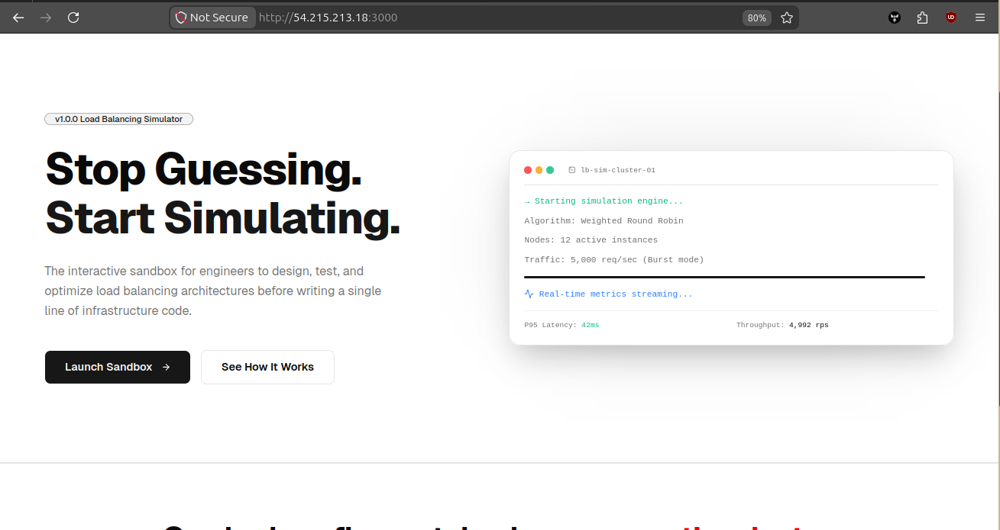

#### Simulation Configuration
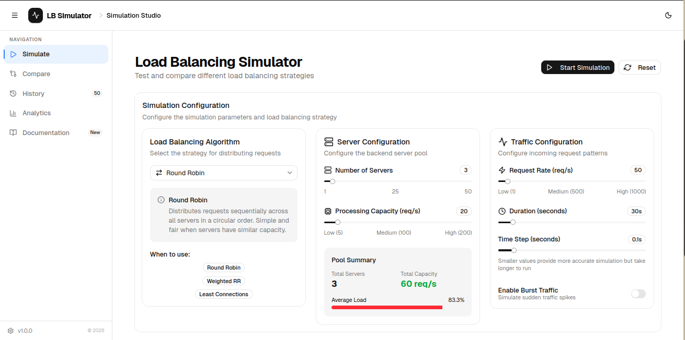

#### Simulation Results
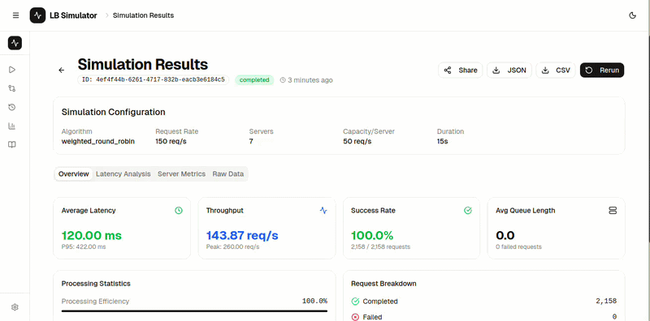

#### Algorithm Comparison
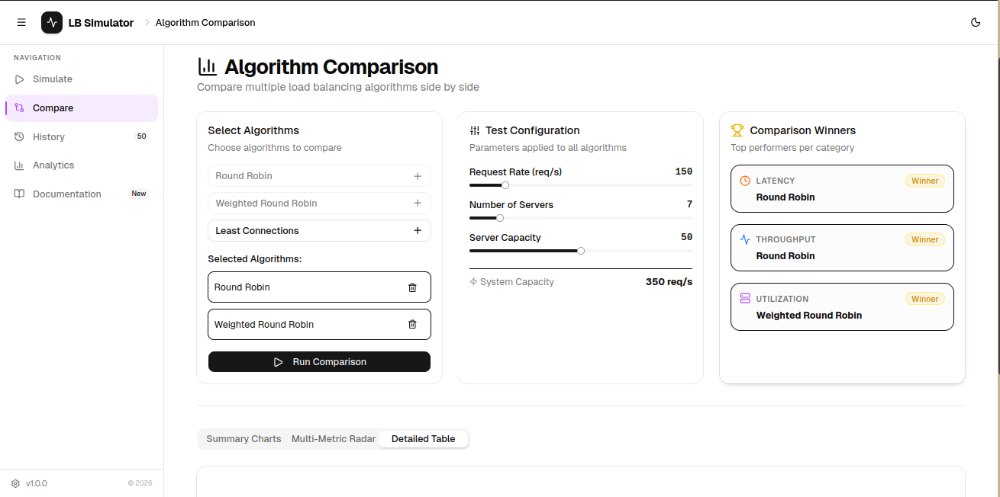

#### Analytics Dashboard
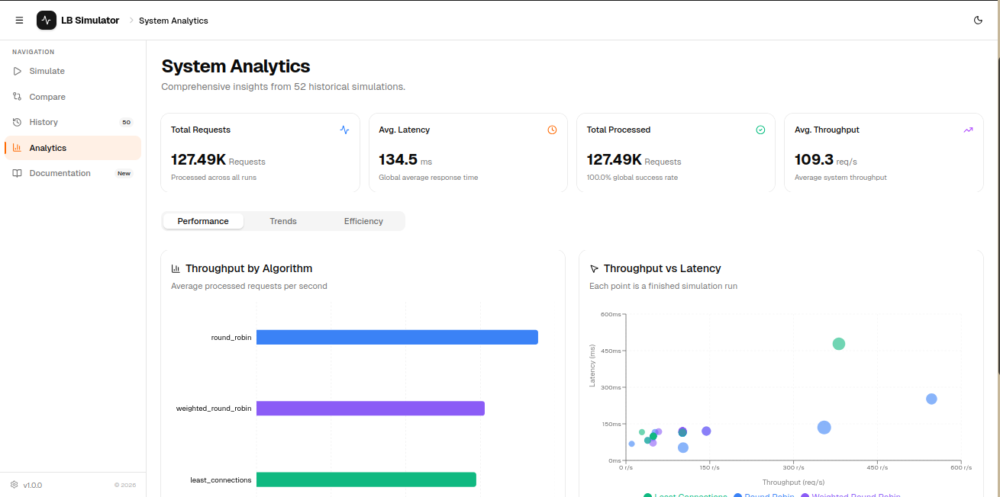


#### Simulation History
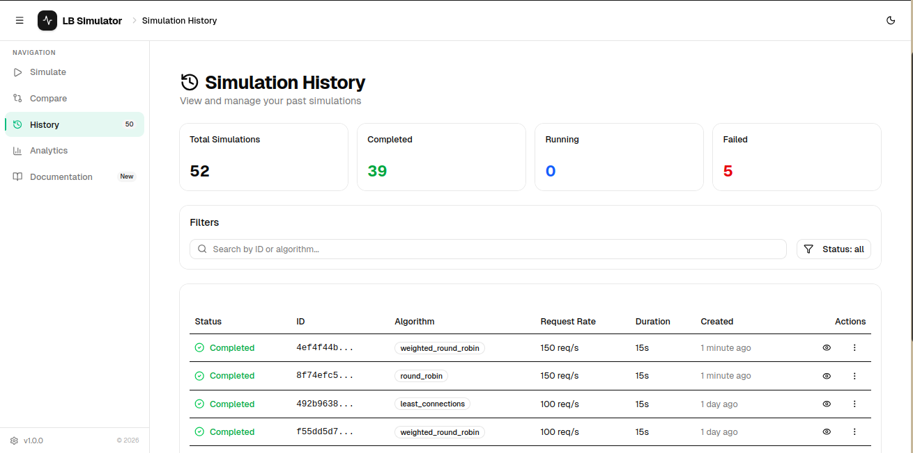

#### Documentation
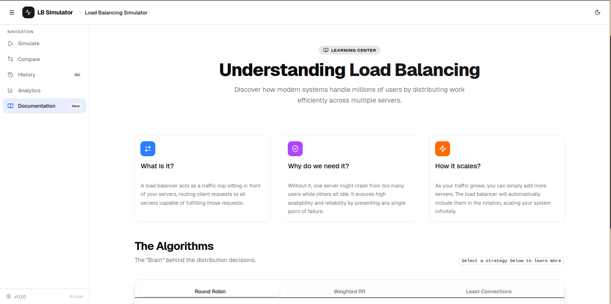

### Infrastructure & Monitoring

#### Database Schema Visualization


#### Kubernetes Deployment
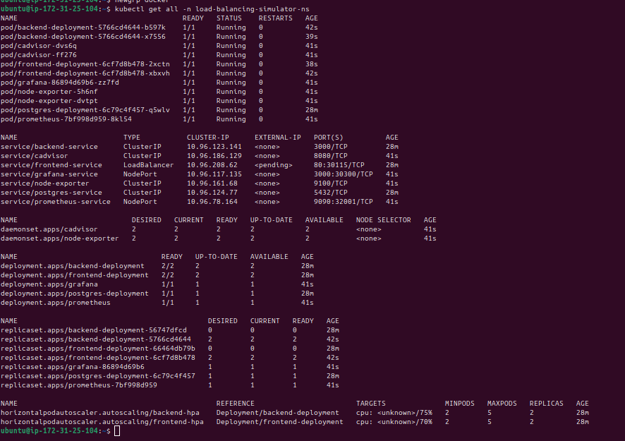

#### Jenkins CI/CD
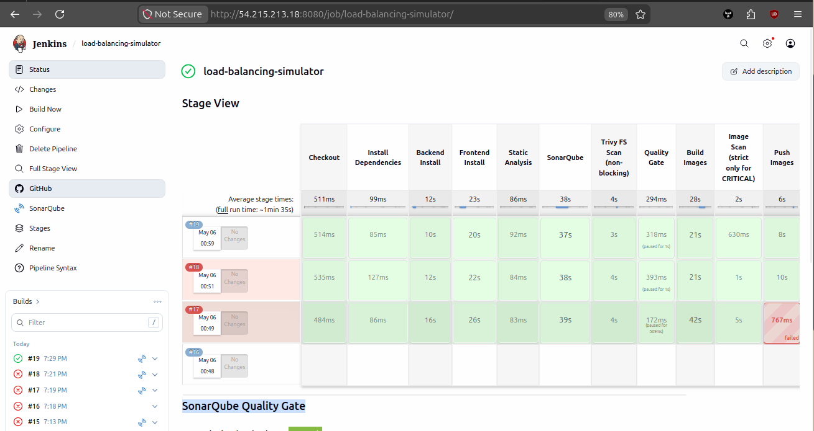

#### Node Exporter


#### Metrics Visualization using Node Exporter
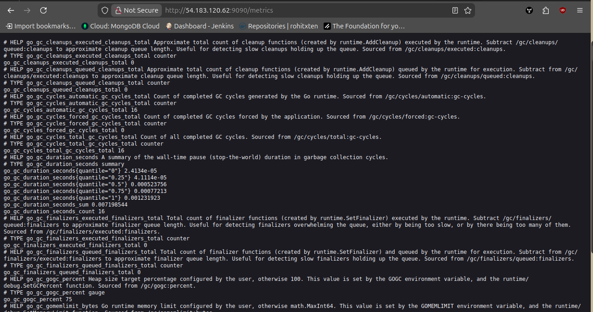

### cAdvice Metrics
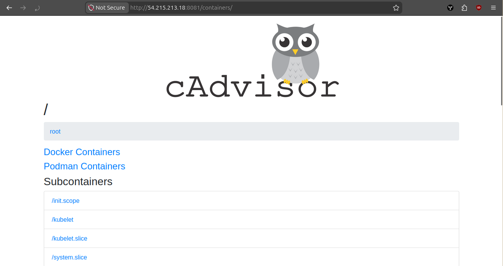
#### Prometheus Monitoring
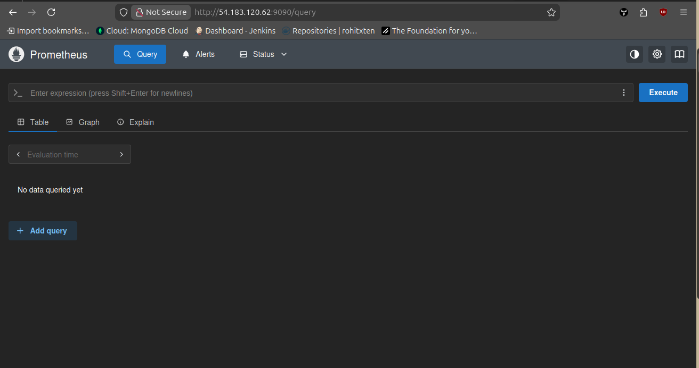

#### Grafana Dashboard


## Installation

### Prerequisites
- **Node.js** (v18 or higher)
- **PostgreSQL** (v14 or higher)
- **npm** or **yarn**

### 1. Clone the repository
```bash
git clone https://github.com/Rohit03022006/load-balancing-simulator.git
cd load-balancing-simulator
```

### 2. Setup Database
Create a PostgreSQL database named `loadbalancer_simulator` and configure your credentials in the backend `.env` file.

### 3. Install Dependencies
```bash
# Install backend dependencies
cd backend
npm install

# Install frontend dependencies
cd ../frontend
npm install
```

## Running the Project

### Development Mode
To run both the backend and frontend in development mode with HMR:

```bash
# In terminal 1 (Backend)
cd backend
npm run dev

# In terminal 2 (Frontend)
cd frontend
npm run dev
```

### Production Build
To generate an optimized production bundle:

```bash
cd frontend
npm run build
```

### Deployment with Docker

The easiest way to run the entire stack (including the database) is using Docker Compose:

```bash
# Build and start all services
docker-compose up --build -d 
or
docker compose up --build -d
```

- **Frontend**: [http://localhost](http://localhost)
- **Backend API**: [http://localhost:3000](http://localhost:3000)
- **Database**: PostgreSQL on port `5432`

## Jenkins CI/CD Pipeline

The project includes a complete Jenkins pipeline for automated testing, building, scanning, and deployment. The pipeline performs the following stages:

### Manual Equivalent Commands

If running outside Jenkins, here are the equivalent commands for each pipeline stage:

**1. Install Dependencies:**
```bash
# Backend
cd backend
docker run --rm -v $PWD:/app -w /app node:18-alpine npm ci

# Frontend
cd ../frontend
docker run --rm -v $PWD:/app -w /app node:18-alpine npm ci
```

**2. Code Quality Analysis:**
```bash
# SonarQube Scan
sonar-scanner \
  -Dsonar.projectName=LoadBalancingSimulator \
  -Dsonar.projectKey=load_balancing_simulator \
  -Dsonar.sources=backend,frontend \
  -Dsonar.exclusions=**/node_modules/**,**/dist/**

# Security Vulnerability Scan (Trivy)
trivy fs --scanners vuln --exit-code 0 --severity HIGH,CRITICAL .
```

**3. Build Docker Images:**
```bash
docker build -t rohitxten/load-balancing-simulator-backend:latest ./backend
docker build \
  --build-arg VITE_API_URL=http://localhost:3000/api/v1 \
  -t rohitxten/load-balancing-simulator-frontend:latest ./frontend
```

**4. Scan Images for Vulnerabilities:**
```bash
# Scan for CRITICAL vulnerabilities only
trivy image --scanners vuln --exit-code 1 --severity CRITICAL rohitxten/load-balancing-simulator-backend:latest
trivy image --scanners vuln --exit-code 1 --severity CRITICAL rohitxten/load-balancing-simulator-frontend:latest
```

**5. Push to Docker Registry:**
```bash
docker login
docker push rohitxten/load-balancing-simulator-backend:latest
docker push rohitxten/load-balancing-simulator-frontend:latest
```

**6. Deploy to Kubernetes:**
```bash
# Apply all Kubernetes manifests
kubectl apply -f K8S/

# Check deployment status
kubectl get pods -n load-balancing-simulator-ns -w

# Port forwarding
kubectl port-forward svc/frontend-service 80:80 -n load-balancing-simulator-ns --address 0.0.0.0
kubectl port-forward svc/backend-service 3000:3000 -n load-balancing-simulator-ns --address 0.0.0.0
```

## AWS Security Group Configuration

When deploying on AWS EC2, configure your security group to open the following ports:

| Port | Service | Protocol | Purpose |
| :--- | :--- | :--- | :--- |
| **80** | HTTP | TCP | Frontend Web Interface |
| **443** | HTTPS | TCP | Frontend Web Interface (Secure) |
| **3000** | Grafana | TCP | Monitoring Dashboard |
| **3001** | Backend API | TCP | Backend API Server |
| **5432** | PostgreSQL | TCP | Database (VPC only - not public) |
| **9090** | Prometheus | TCP | Metrics & Monitoring |
| **8080** | Jenkins | TCP | Jenkins Web Interface |
| **22** | SSH | TCP | Server Access |

### AWS CLI Commands to Create Security Group:

```bash
# Create security group
aws ec2 create-security-group \
  --group-name load-balancing-simulator \
  --description "Load Balancing Simulator Security Group" \
  --vpc-id vpc-xxxxx

# Store the group ID (replace sg-xxxxx below)
SG_ID="sg-xxxxx"

# Add ingress rules
aws ec2 authorize-security-group-ingress --group-id $SG_ID --protocol tcp --port 80 --cidr 0.0.0.0/0
aws ec2 authorize-security-group-ingress --group-id $SG_ID --protocol tcp --port 443 --cidr 0.0.0.0/0
aws ec2 authorize-security-group-ingress --group-id $SG_ID --protocol tcp --port 3000 --cidr 0.0.0.0/0
aws ec2 authorize-security-group-ingress --group-id $SG_ID --protocol tcp --port 3001 --cidr 0.0.0.0/0
aws ec2 authorize-security-group-ingress --group-id $SG_ID --protocol tcp --port 9090 --cidr 0.0.0.0/0
aws ec2 authorize-security-group-ingress --group-id $SG_ID --protocol tcp --port 22 --cidr 0.0.0.0/0

# PostgreSQL (restrict to VPC CIDR only)
aws ec2 authorize-security-group-ingress --group-id $SG_ID --protocol tcp --port 5432 --cidr 10.0.0.0/8
```

##  Load Balancing Algorithms

| Algorithm | Logic | Best Used For |
| :--- | :--- | :--- |
| **Round Robin** | Routes requests sequentially: `(index + 1) % n` | Homogeneous clusters with identical server specs. |
| **Weighted Round Robin** | Allocates more traffic to higher-capacity servers based on a `weight` coefficient. | Heterogeneous clusters with varied hardware. |
| **Least Connections** | Routes to the server with the fewest active requests in its queue. | Workloads with highly variable request processing times. |

### Mathematical Foundation
For **Weighted Round Robin**, the selection probability $P$ for server $i$ is defined as:
$$P_i = \frac{W_i}{\sum_{j=1}^{n} W_j}$$
where $W$ is the assigned weight of the server.

## Performance Considerations

- **Discrete Event Granularity**: The simulation uses a default time step of `0.1s`. For higher fidelity, this can be reduced, though it increases CPU overhead.
- **Persistence**: High-frequency metrics are batched before being committed to PostgreSQL to maintain high throughput.
- **Concurrency**: The simulation engine is currently single-threaded within the Node.js event loop; extremely large clusters (>1000 nodes) may experience execution slowdowns.

##  Contributing

We welcome contributions to improve the simulator! 

1.  **Fork** the repository.
2.  **Create** a feature branch (`git checkout -b feature/AmazingFeature`).
3.  **Commit** your changes (`git commit -m 'Add some AmazingFeature'`).
4.  **Push** to the branch (`git push origin feature/AmazingFeature`).
5.  **Open** a Pull Request.

---
© 2026 Load Balancing Simulator Project. Licensed under MIT.
